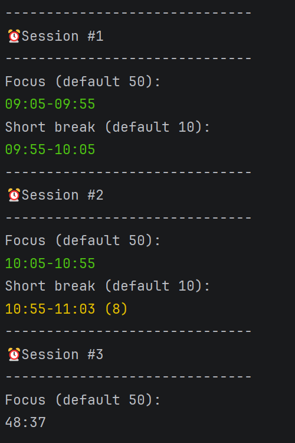
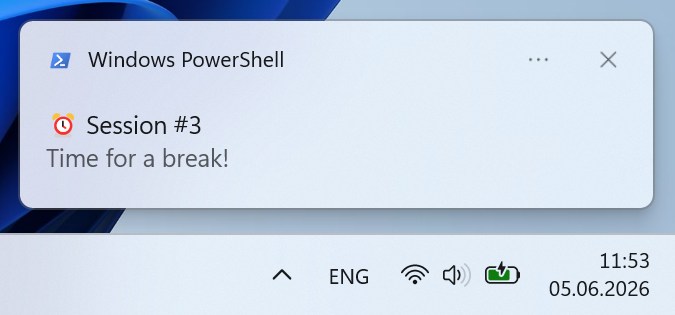

# pomodoro

A cross-platform timer with logging and notifications.



*App flow*



*Windows notification*


*Linux notification*

## Usage

```sh
# Help
pomodoro --help

# Example
pomodoro --focus 50 --short-break 10 --long-break 30
```
